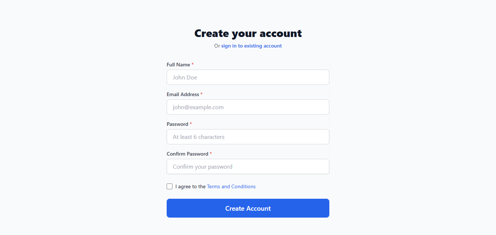
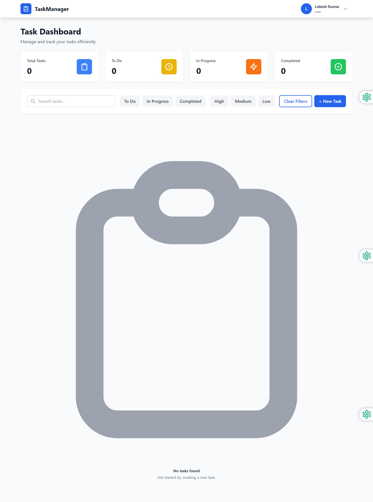

# Task Management App

A full-stack task management application built with **React.js, Node.js, Express.js, MongoDB, JWT, and Socket.io**.

The application allows users to register, log in securely, create and manage tasks, filter tasks, and receive real-time task updates.

## 📸 Screenshots

### 🔐 Sign In Page


### 📝 Register Page



### 📊 Dashboard



## 🚀 Features

* 🔐 User Registration & Login
* 🔑 JWT Authentication
* 🛡️ Protected Routes
* ➕ Create Tasks
* ✏️ Update Tasks
* 🗑️ Delete Tasks
* 📋 View Task List
* 🔎 Task Filtering
* 📊 Task Statistics
* 👤 User Management
* ⚡ Real-time updates with Socket.io
* 📱 Responsive UI
* 🗄️ MongoDB Atlas Database
* ⚠️ Form Validation & Error Handling

## 🛠️ Tech Stack

### Frontend

* React.js
* React Router
* Tailwind CSS
* Axios
* Socket.io Client
* Context API

### Backend

* Node.js
* Express.js
* MongoDB
* Mongoose
* JSON Web Token (JWT)
* Socket.io
* bcrypt
* dotenv

## 📁 Project Structure

```text
task-management-app/
│
├── backend/
│   ├── src/
│   │   ├── config/
│   │   │   └── db.js
│   │   ├── controllers/
│   │   │   ├── authController.js
│   │   │   ├── taskController.js
│   │   │   └── userController.js
│   │   ├── middleware/
│   │   │   ├── auth.js
│   │   │   ├── errorHandler.js
│   │   │   ├── roleCheck.js
│   │   │   └── validate.js
│   │   ├── models/
│   │   │   ├── Task.js
│   │   │   └── User.js
│   │   ├── routes/
│   │   │   ├── authRoutes.js
│   │   │   ├── taskRoutes.js
│   │   │   └── userRoutes.js
│   │   ├── socket/
│   │   │   └── taskSocket.js
│   │   └── utils/
│   │       ├── jwt.js
│   │       └── validation.js
│   │
│   ├── server.js
│   ├── package.json
│   └── .env
│
├── frontend/
│   ├── public/
│   ├── src/
│   │   ├── components/
│   │   │   ├── auth/
│   │   │   ├── common/
│   │   │   ├── layout/
│   │   │   └── tasks/
│   │   ├── context/
│   │   ├── hooks/
│   │   ├── pages/
│   │   ├── services/
│   │   ├── utils/
│   │   ├── App.jsx
│   │   └── index.js
│   └── package.json
│
├── screenshots/
│   ├── login.png
│   ├── register.png
│   └── dashboard.png
│
├── .gitignore
└── README.md
```

## ⚙️ Installation & Setup

### 1. Clone the Repository

```bash
git clone https://github.com/lokeshkumar72/task-management-app.git
```

```bash
cd task-management-app
```

### 2. Setup Backend

```bash
cd backend
npm install
```

Create a `.env` file inside the `backend` folder:

```env
NODE_ENV=development
PORT=5000
CLIENT_URL=http://localhost:3000

MONGODB_URI=your_mongodb_connection_string

JWT_SECRET=your_jwt_secret
JWT_REFRESH_SECRET=your_refresh_secret
JWT_EXPIRES_IN=1h
```

Start the backend:

```bash
npm start
```

The backend will run on:

```text
http://localhost:5000
```

### 3. Setup Frontend

Open a new terminal:

```bash
cd frontend
npm install
```

Start the React application:

```bash
npm start
```

The frontend will run on:

```text
http://localhost:3000
```

## 🔐 Environment Variables

Never commit your `.env` file to GitHub.

Use your own MongoDB and JWT credentials:

```env
MONGODB_URI=your_mongodb_uri
JWT_SECRET=your_jwt_secret
JWT_REFRESH_SECRET=your_refresh_secret
```

## 🗄️ Database

This project uses **MongoDB Atlas** with **Mongoose** for database management.

The main collections/models are:

* Users
* Tasks

## 🔑 Authentication

Authentication is implemented using:

* JWT access tokens
* JWT refresh tokens
* Password hashing
* Protected routes
* Role-based access control

## ⚡ Real-Time Communication

**Socket.io** is used for real-time task updates between connected users.

This allows changes to tasks to be communicated without requiring a full page refresh.

## 📱 Responsive Design

The frontend is designed to work across:

* 💻 Desktop
* 💻 Laptop
* 📱 Mobile
* 📱 Tablet

## 🧪 Testing

Run frontend tests with:

```bash
cd frontend
npm test
```

## 🏗️ Production Build

Create a production build of the frontend:

```bash
cd frontend
npm run build
```

The optimized production files will be generated in:

```text
frontend/build/
```

## 🔮 Future Improvements

* Email notifications
* Task priority levels
* Task due-date reminders
* Drag-and-drop task management
* Advanced search
* Dark mode
* Admin dashboard
* Task activity history
* Deployment with CI/CD

## 👨‍💻 Author

**Lokesh Kumar Singh**

### Connect with me

* GitHub: `https://github.com/lokeshkumar72`
* LinkedIn: `https://linkedin.com/in/lokesh-kumar-singh-/`

## ⭐ Support

If you find this project useful, consider giving it a ⭐ on GitHub.
